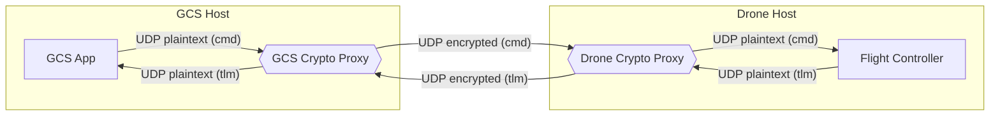
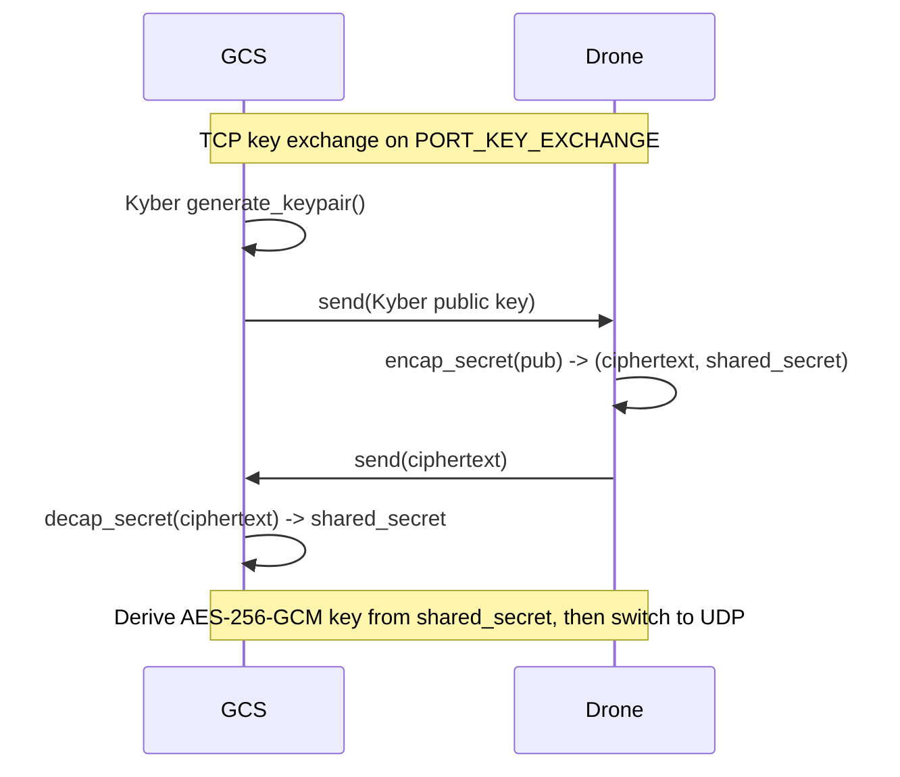
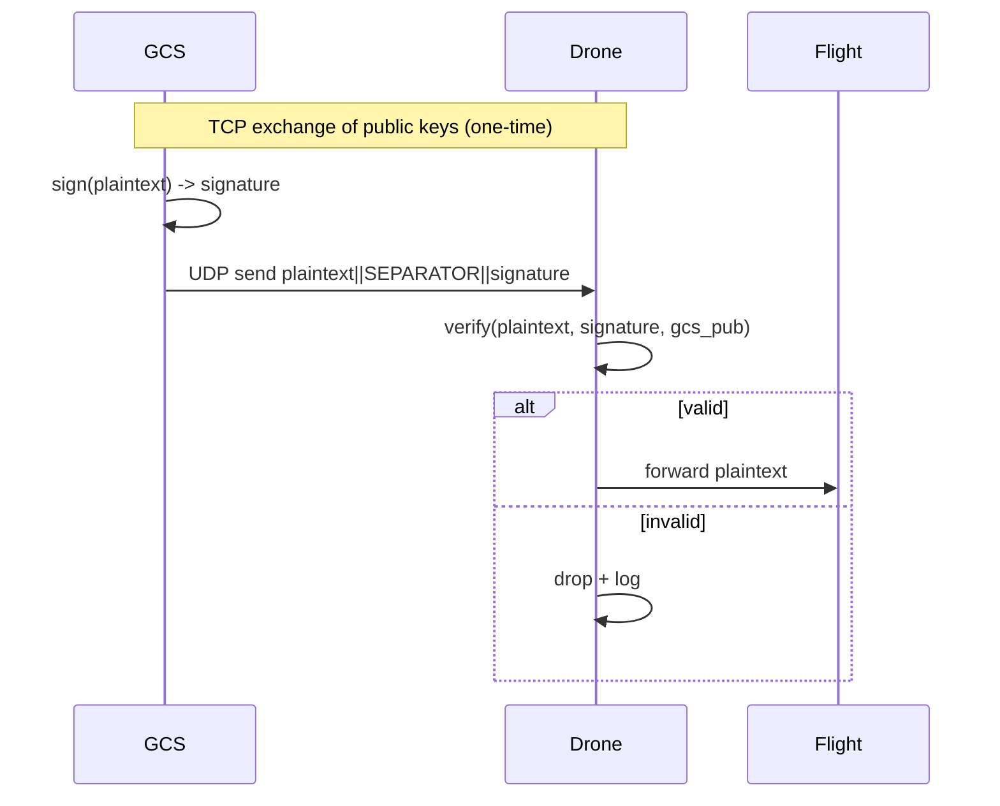

# GCS–Drone Crypto Proxies (Post-Quantum + Classic)

A reproducible Ground Control Station (GCS) ↔ Drone crypto proxy stack supporting both post-quantum and classic algorithms. All implementations below have been validated end-to-end on localhost with the outputs provided.

- Status: 9/9 working
  - PQC: Kyber (hybrid KEM, ML-KEM-768), Dilithium (ML-DSA), Falcon, SPHINCS+
  - Classic: AES‑GCM, ASCON‑128 (AEAD), Camellia‑CBC, HIGHT‑CBC, Speck‑CBC

## What’s in this repo

- `gcs/` and `drone/`: Proxy scripts per algorithm
- `ip_config.py`: Central ports and hosts (plus scoped copies in `gcs/` and `drone/`)
- `requirements.txt`: Python dependencies
- `drneha/`: High-quality reference implementations (ASCON, Camellia, HIGHT, Speck)

## Quick architecture



### Kyber hybrid handshake (sequence)



### Signature flow (Dilithium/Falcon/SPHINCS+)



## Ports and hosts

| Purpose | Port var | Default |
|---|---|---|
| TCP key exchange | `PORT_KEY_EXCHANGE` | 5800 |
| GCS listens plaintext commands | `PORT_GCS_LISTEN_PLAINTEXT_CMD` | 5810 |
| Drone listens encrypted commands | `PORT_DRONE_LISTEN_ENCRYPTED_CMD` | 5811 |
| Drone forwards decrypted commands | `PORT_DRONE_FORWARD_DECRYPTED_CMD` | 5812 |
| Drone listens plaintext telemetry | `PORT_DRONE_LISTEN_PLAINTEXT_TLM` | 5820 |
| GCS listens encrypted telemetry | `PORT_GCS_LISTEN_ENCRYPTED_TLM` | 5821 |
| GCS forwards decrypted telemetry | `PORT_GCS_FORWARD_DECRYPTED_TLM` | 5822 |

Hosts: `GCS_HOST = 127.0.0.1`, `DRONE_HOST = 127.0.0.1` by default (see `ip_config.py`). For deployment, set to your actual IPs on each machine.

## Algorithms implemented

| Family | Mode/Variant | Key | Nonce/IV | Auth | Source |
|---|---|---|---|---|---|
| Kyber hybrid | KEM + AES‑GCM | derived 32B | 12B | AEAD | liboqs + cryptography |
| Kyber (ML‑KEM‑768) | KEM + AES‑GCM | derived 32B | 12B | AEAD | liboqs + cryptography |
| Dilithium (ML‑DSA) | Sign/Verify | n/a | n/a | Sign | liboqs |
| Falcon | Sign/Verify | n/a | n/a | Sign | liboqs |
| SPHINCS+ | Sign/Verify | n/a | n/a | Sign | liboqs |
| ASCON‑128 | AEAD | 16B | 16B | AEAD | drneha.ascon |
| AES | AES‑256‑GCM | 32B | 12B | AEAD | cryptography |
| Camellia | CBC | 16/24/32B | 16B | No MAC | cryptography |
| HIGHT | CBC | 16B MK | 8B | No MAC | drneha.hight |
| Speck | CBC | 16B | 16B | No MAC | drneha Speck |

Notes:
- CBC modes (Camellia/HIGHT/Speck) provide confidentiality only; add HMAC for authenticity in production.
- ASCON and AES‑GCM already provide authenticity (AEAD).

## Verified outputs (local tests)

The following were executed in PowerShell on Windows using the repo as `sys.path`. Each pair initialized in-process and performed round-trips.

### Kyber (ML‑KEM‑768)
```
[KYBER GCS] Starting Key Exchange (ML-KEM-768)...
[KYBER GCS] Waiting on 127.0.0.1:5800...
[KYBER Drone] Starting Key Exchange (ML-KEM-768)...
[KYBER Drone] Connected to 127.0.0.1:5800
[KYBER GCS] Drone connected from ('127.0.0.1', 57295)
✅ [KYBER Drone] Shared key established
✅ [KYBER GCS] Shared key established
KYBER (ML-KEM-768) g->d ok: True ; d->g ok: True
```

### Kyber hybrid
```
[KYBER GCS] Starting Key Exchange...
[KYBER GCS] Using liboqs Kyber1024
[KYBER GCS] Waiting for Drone to connect for key exchange on 127.0.0.1:5800...
[KYBER Drone] Starting Post-Quantum Key Exchange...
[KYBER Drone] Using liboqs Kyber1024
[KYBER Drone] Connected to GCS at 127.0.0.1:5800
[KYBER GCS] Drone connected from ('127.0.0.1', 62832)
[KYBER GCS] Public key sent.
[KYBER Drone] Public key received.
[KYBER Drone] Ciphertext sent.
[KYBER GCS] Ciphertext received.
✅ [KYBER Drone] Secure shared key established successfully!
✅ [KYBER GCS] Secure shared key established successfully!
KYBER hybrid g->d ok: True ; d->g ok: True
```

### Dilithium (ML‑DSA)
```
[DILITHIUM GCS] Starting Public Key Exchange...
[DILITHIUM GCS] Using liboqs Dilithium
[DILITHIUM GCS] Waiting for Drone to connect for key exchange on 127.0.0.1:5800...
[DILITHIUM Drone] Starting PQC Public Key Exchange...
[DILITHIUM Drone] Using liboqs Dilithium
[DILITHIUM Drone] Connected to GCS at 127.0.0.1:5800
[DILITHIUM GCS] Drone connected from ('127.0.0.1', 62437)
[DILITHIUM Drone] GCS public key received.
[DILITHIUM GCS] GCS public key sent.
[DILITHIUM Drone] Drone public key sent.
[DILITHIUM GCS] Drone public key received.
✅ [DILITHIUM Drone] Public key exchange complete!
✅ [DILITHIUM GCS] Public key exchange complete!
DILITHIUM g->d verify ok: True ; d->g verify ok: True
```

### Falcon
```
[FALCON GCS] Starting Public Key Exchange...
[FALCON GCS] Using liboqs Falcon-512
[FALCON GCS] Waiting for Drone to connect on 127.0.0.1:5800...
[FALCON Drone] Starting PQC Public Key Exchange...
[FALCON Drone] Using liboqs Falcon-512
[FALCON Drone] Connected to GCS at 127.0.0.1:5800
[FALCON GCS] Drone connected from ('127.0.0.1', 57200)
[FALCON GCS] GCS public key sent.
[FALCON Drone] GCS public key received.
[FALCON GCS] Drone public key received.
[FALCON Drone] Drone public key sent.
✅ [FALCON Drone] Public key exchange complete!
✅ [FALCON GCS] Public key exchange complete!
FALCON g->d verify ok: True ; d->g verify ok: True
```

### SPHINCS+
```
[SPHINCS GCS] Starting Public Key Exchange...
[SPHINCS GCS] Waiting on 127.0.0.1:5800...
[SPHINCS Drone] Starting PQC Public Key Exchange...
[SPHINCS Drone] Connected to 127.0.0.1:5800
[SPHINCS GCS] Drone connected from ('127.0.0.1', 49683)
[SPHINCS GCS] Public keys exchanged.
✅ [SPHINCS GCS] Public key exchange complete!
[SPHINCS Drone] Public keys exchanged.
SPHINCS g->d verify ok: True ; d->g verify ok: True
```

### HIGHT (CBC)
```
HIGHT d->g ok: True
HIGHT g->d ok: True
```

### Camellia (CBC)
```
Camellia g->d ok: True ; d->g ok: True
```

### Speck (CBC)
```
SPECK g->d ok: True ; d->g ok: True
```

### ASCON‑128 (AEAD)
```
ASCON g->d ok: True ; d->g ok: True
```

### Enabled signature mechanisms (liboqs)
```
SIG mechanisms: ('Dilithium2', 'Dilithium3', 'Dilithium5', 'ML-DSA-44', 'ML-DSA-65', 'ML-DSA-87', 'Falcon-512', 'Falcon-1024', 'Falcon-padded-512', 'Falcon-padded-1024', 'SPHINCS+-SHA2-128f-simple', 'SPHINCS+-SHA2-128s-simple', 'SPHINCS+-SHA2-192f-simple', 'SPHINCS+-SHA2-192s-simple', 'SPHINCS+-SHA2-256f-simple', 'SPHINCS+-SHA2-256s-simple', 'SPHINCS+-SHAKE-128f-simple', 'SPHINCS+-SHAKE-128s-simple', 'SPHINCS+-SHAKE-192f-simple', 'SPHINCS+-SHAKE-192s-simple', 'SPHINCS+-SHAKE-256f-simple', 'SPHINCS+-SHAKE-256s-simple', 'MAYO-1', 'MAYO-2', 'MAYO-3', 'MAYO-5', 'cross-rsdp-128-balanced', 'cross-rsdp-128-fast', 'cross-rsdp-128-small', 'cross-rsdp-192-balanced', 'cross-rsdp-192-fast', 'cross-rsdp-192-small', 'cross-rsdp-256-balanced', 'cross-rsdp-256-fast', 'cross-rsdp-256-small', 'cross-rsdpg-128-balanced', 'cross-rsdpg-128-fast', 'cross-rsdpg-128-small', 'cross-rsdpg-192-balanced', 'cross-rsdpg-192-fast', 'cross-rsdpg-192-small', 'cross-rsdpg-256-balanced', 'cross-rsdpg-256-fast', 'cross-rsdpg-256-small', 'OV-Is', 'OV-Ip', 'OV-III', 'OV-V', 'OV-Is-pkc', 'OV-Ip-pkc', 'OV-III-pkc', 'OV-V-pkc', 'OV-Is-pkc-skc', 'OV-Ip-pkc-skc', 'OV-III-pkc-skc', 'OV-V-pkc-skc', 'SNOVA_24_5_4', 'SNOVA_24_5_4_SHAKE', 'SNOVA_24_5_4_esk', 'SNOVA_24_5_4_SHAKE_esk', 'SNOVA_37_17_2', 'SNOVA_25_8_3', 'SNOVA_56_25_2', 'SNOVA_49_11_3', 'SNOVA_37_8_4', 'SNOVA_24_5_5', 'SNOVA_60_10_4', 'SNOVA_29_6_5')
```

## Running the proxies

1) Update `ip_config.py` on each machine:
- GCS machine: set `GCS_HOST` to the GCS IP and `DRONE_HOST` to the drone IP.
- Drone machine: set the same two constants consistently.

2) Install dependencies

```powershell
# Windows PowerShell
pip install -r requirements.txt
```

```bash
# Raspberry Pi OS (arm64), example
python3 -m pip install --upgrade pip wheel
pip3 install -r requirements.txt
```

3) Start a pair (example: Kyber hybrid)

- On GCS:
```powershell
python gcs\\gcs_kyber_hybrid.py
```
- On Drone (Raspberry Pi 4B):
```bash
python3 drone/drone_kyber_hybrid.py
```

4) Swap algorithms by starting a different pair (`gcs_*.py` with matching `drone_*.py`).

Example: ML‑KEM‑768 (normal Kyber)

- On GCS:
```powershell
python gcs\gcs_kyber.py
```
- On Drone (Raspberry Pi 4B):
```bash
python3 drone/drone_kyber.py
```

## Reproducibility and config

- Both `gcs/` and `drone/` contain an `ip_config.py` copy scoped for that subpackage; there is also a root `ip_config.py`. Keep them consistent or centralize imports as preferred. Ports and hosts are documented in this README.

## Benchmarking (decrypt/verify time)

Use `time.perf_counter()` around `decrypt_message` (AEAD/CBC) or `verify_message` (signatures). Example snippet:

```python
import time
from gcs.gcs_ascon import decrypt_message as dec
from drone.drone_ascon import encrypt_message as enc

m = b"test" * 100
ct = enc(m)
N = 1000
start = time.perf_counter()
for _ in range(N):
    _ = dec(ct)
end = time.perf_counter()
print(f"ASCON decrypt avg: {(end-start)/N*1e6:.1f} us")
```

For signature schemes, wrap the `verify_message()` call similarly. On Raspberry Pi 4B, ensure the device is in performance governor for consistent timing.

### Benchmark harness (portable)

You can also run the portable harness `bench/benchmark.py` to time all algorithms consistently on Windows or Raspberry Pi:

```powershell
# Windows PowerShell examples
python bench\benchmark.py --algo aes --iters 2000 --size 256
python bench\benchmark.py --algo ascon --iters 2000 --size 256
python bench\benchmark.py --algo kyber --iters 500 --size 128
python bench\benchmark.py --algo kyber_hybrid --iters 500 --size 128
python bench\benchmark.py --algo dilithium --iters 200 --size 128
python bench\benchmark.py --algo falcon --iters 200 --size 128
python bench\benchmark.py --algo sphincs --iters 50 --size 128
```

```bash
# Raspberry Pi examples
python3 bench/benchmark.py --algo aes --iters 2000 --size 256
python3 bench/benchmark.py --algo ascon --iters 2000 --size 256
python3 bench/benchmark.py --algo kyber --iters 500 --size 128
python3 bench/benchmark.py --algo kyber_hybrid --iters 500 --size 128
python3 bench/benchmark.py --algo dilithium --iters 200 --size 128
python3 bench/benchmark.py --algo falcon --iters 200 --size 128
python3 bench/benchmark.py --algo sphincs --iters 50 --size 128
```

Algorithms: `aes`, `ascon`, `camellia`, `hight`, `speck`, `kyber` (ML‑KEM‑768), `kyber_hybrid`, `dilithium`, `falcon`, `sphincs`.

## Raspberry Pi 4B notes

- Python: Use the system Python 3 (or `pyenv`) and `pip3 install -r requirements.txt`.
- liboqs‑python: Prebuilt wheels may not exist for ARM; build from source if needed:
  - Install toolchain: `sudo apt-get install -y build-essential cmake ninja-build libssl-dev`
  - Build liboqs, then `pip3 install liboqs-python` which will compile against it.
- cryptography: Requires Rust toolchain if no wheel; ensure `pip install cryptography` succeeds (recent wheels often available for ARM64).

## Security notes and next steps

- Add HMAC (e.g., HMAC‑SHA256) to CBC modes for authenticity.
- Optionally derive AES‑GCM keys via HKDF from KEM shared secrets.
- Add minimal automated tests per proxy and a small benchmarking harness.

---

Maintained in `main`. See `drneha/` for reference cipher implementations used in this stack.
