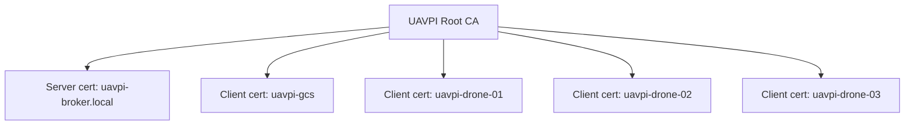

# UAVPI Security Framework: PKI + mTLS MQTT

This document describes the UAVPI-branded Public Key Infrastructure (PKI) and the mutual‑TLS (mTLS) MQTT configuration that resolves prior TLS verification failures.

## 1. Chain of Trust

- The Root CA signs both the broker server certificate and all client certificates.
- mTLS authenticates both sides, eliminating "unknown ca" and "self-signed in chain" errors when the broker and clients are configured to trust the same CA.

## 2. IP‑Independent Identity

- CN is the stable identity (e.g., `uavpi-drone-01`, `uavpi-gcs`).
- Server SANs encode flexible locations/hostnames: `uavpi-broker.local`, `localhost`, `127.0.0.1`, `192.168.0.100`.
- Clients validate the broker using SANs; clients are identified to the broker via their CN through `use_identity_as_username true`.

## 3. MQTT Topic Framework

- Broadcast: `swarm/broadcast/#`
- Drone status: `swarm/status/{drone_id}`
- Drone alerts: `swarm/alert/{drone_id}`
- Commands to an individual drone: `swarm/commands/individual/{drone_id}`

ACL (see `swarm_acl.conf`):
- `user uavpi-gcs` has `readwrite` to `swarm/#`.
- Patterns using `%c` (client CN):
  - `pattern write swarm/status/%c`
  - `pattern write swarm/alert/%c`
  - `pattern read swarm/broadcast/#`
  - `pattern read swarm/commands/individual/%c`

## 4. First Run Guide (Windows)

Prerequisites:
- OpenSSL and Mosquitto installed, available in PATH.

Steps:
1. Generate PKI:
   - Run PowerShell: `tools/pki/generate-pki.ps1`
   - This creates `certs/` with `ca-cert.pem`, `server-cert.pem`, `server-key.pem`, `uavpi-gcs-cert.pem`, `uavpi-drone-01-cert.pem`, etc.
2. Configure Mosquitto:
   - Ensure `mosquitto.conf` and `swarm_acl.conf` are in the repo root.
   - Start broker with: `mosquitto -c mosquitto.conf`
3. Test clients:
   - GCS: `python tools/mqtt_test_client.py --client-id uavpi-gcs`
   - Drone: `python tools/mqtt_test_client.py --client-id uavpi-drone-01`
4. Verify:
   - Successful TLS handshake.
   - Mosquitto logs show authenticated usernames matching CNs.
   - Messages flow per ACL.

Troubleshooting:
- `CERTIFICATE_VERIFY_FAILED`: client using wrong `cafile`.
- `tlsv1 alert unknown ca`: broker `cafile` not set or mismatched.
- Hostname mismatch: connect to a host covered by server SANs.
