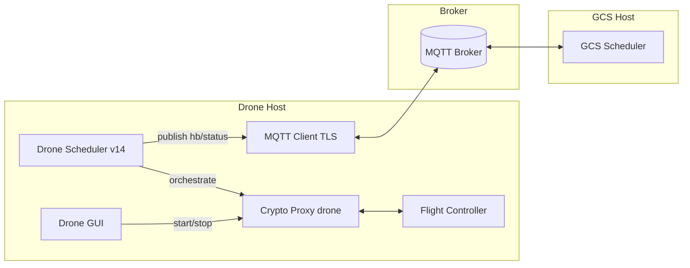
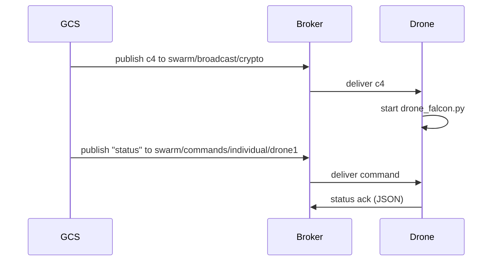
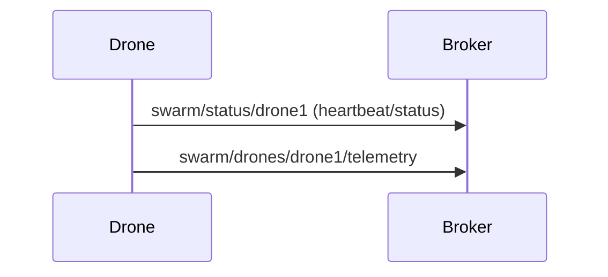

# Drone Scheduler — Visual Guide and Storyline

A mission-grade Drone-side scheduler that reacts to GCS directives, maintains secure comms, and keeps crypto resilient while staying resource-aware.

## Narrative: Drone POV

The drone is the action-plane. It follows GCS directives, switches crypto when told, and keeps the link alive under constrained power and thermal budgets. It reports heartbeats, status, and telemetry to give the control-plane real-time awareness.

## Two flavors included

- Drone MQTT Scheduler GUI: `drone_mqtt_scheduler.py` (simple, interactive)
- Drone UAV Scheduler v14: `drone_scheduler_v14.py` (robust, queue-based, TLS-only)

## Architecture (Drone)

## Scheduling model (Drone v14)

- Queue-based message processing (thread-safe): MQTT callbacks enqueue; main processor handles logic.
- Process lifecycle governance: start/stop crypto proxies with auto-restart for resilience.
- Reliability patterns: TLS MQTT, CA validation, exponential backoff, retained status.
- Metrics and observability: CSV logs for CPU, battery, temperature, and current crypto.

### Session timeline

```mermaid
gantt
  dateFormat  X
  title Drone v14 Timeline
  section Init
  Cert discovery (TLS)    :done, 0, 1
  MQTT connect            :done, 1, 1
  section Operate
  Heartbeats/Status       :active, 2, 6
  Crypto Switch (cN)      : 3, 1
  Auto-restart crashed    : 4, 3
```

## Message flows

### Broadcast crypto and individual commands

### Telemetry and heartbeat

## Crypto codes and mappings (Drone)

| Code | Algorithm         | Script               |
|------|-------------------|----------------------|
| c1   | ASCON‑128         | drone_ascon.py       |
| c2   | Speck‑CBC         | drone_speck.py       |
| c3   | Camellia‑CBC      | drone_camellia.py    |
| c4   | HIGHT‑CBC         | drone_hight.py       |
| c5   | Dilithium         | drone_dilithium.py   |
| c6   | Kyber (ML‑KEM‑768)| drone_kyber.py       |
| c7   | SPHINCS+          | drone_sphincs.py     |
| c8   | Falcon‑512        | drone_falcon.py      |

## MQTT topics (Drone)

| Purpose              | Topic                                  | QoS |
|----------------------|----------------------------------------|-----|
| Receive broadcast    | swarm/broadcast/crypto                 | 2   |
| Receive alerts       | swarm/broadcast/alert                  | 2   |
| Receive commands     | swarm/commands/individual/<drone_id>   | 2   |
| Publish status       | swarm/status/<drone_id>                | 1   |
| Publish heartbeat    | swarm/heartbeat/<drone_id>             | 1   |
| Publish telemetry    | swarm/drones/<drone_id>/telemetry      | 1   |

## Certificates and security

- Files: `ca-cert.pem`, `<drone-id>-cert.pem`, `<drone-id>-key.pem`
- Searched paths: `drone/certs`, `../certs`, `C:/mqtt/certs`, `/etc/mqtt/certs`, `/home/dev/mqtt/certs`
- Hostname verification disabled when connecting to IP brokers; CA still required.

## IP configuration (runtime vs persistent)

- Runtime: update in-memory via `ip_config.set_hosts_runtime()` (GUI and v14 use this internally if needed)
- Persistent: edits `drone/ip_config.py` in-place with timestamped comments

## Try it

- Install deps:
  - `pip install -r drone/requirements.txt`
- Ensure certs exist; set broker IP (GCS_HOST) in `ip_config.py` or via CLI `--broker`
- Run v14:
  - `python drone/drone_scheduler_v14.py --drone-id drone1 --broker 192.168.0.103 --port 8883 --start-crypto c6`
- Or run GUI:
  - `python drone/drone_mqtt_scheduler.py`

---
For GCS-side orchestration details and GUI controls, see `../gcs/README.md`.
