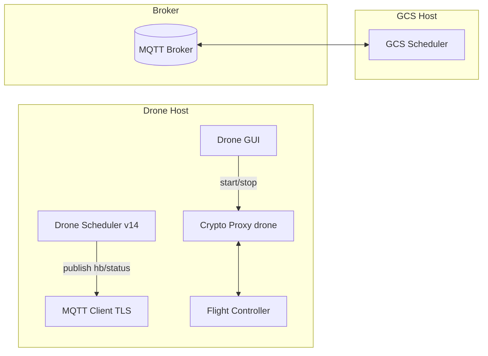
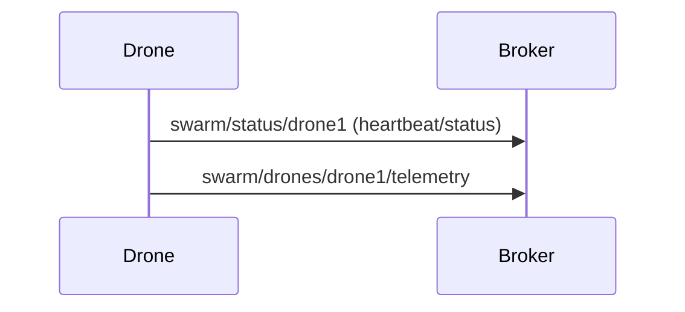

# Drone Scheduler — Visual Guide and Storyline

A mission-grade Drone-side scheduler that reacts to GCS directives, maintains secure comms, and keeps crypto resilient while staying resource-aware.

## Narrative: Drone POV


### Linux scheduling (brief)

- Linux uses the Completely Fair Scheduler (CFS). User space can nudge CPU share by setting “niceness”:
  - Lower nice (e.g., negative) means higher priority for CPU time; higher nice yields CPU to others.
  - v14 doesn’t change kernel policies; it only sets niceness for its child processes.
- We keep it simple and predictable: only CPU niceness is adjusted; no special cgroups/rt policies.
- Drone MQTT Scheduler GUI: `drone_mqtt_scheduler.py` (simple, interactive)
- Drone UAV Scheduler v14: `drone_scheduler_v14.py` (robust, queue-based, TLS-only)

## Architecture (Drone)


- Queue-based message processing (thread-safe): MQTT callbacks enqueue; main processor handles logic.
- Process lifecycle governance: start/stop crypto proxies with auto-restart for resilience.

```mermaid
  section Init
  Cert discovery (TLS)    :done, 0, 1
  MQTT connect            :done, 1, 1
  Heartbeats/Status       :active, 2, 6
  Crypto Switch (cN)      : 3, 1
  Auto-restart crashed    : 4, 3

## Message flows

### Broadcast crypto and individual commands

```mermaid
sequenceDiagram
  participant GCS
  participant Broker
  participant Drone
  GCS->>Broker: publish c4 to swarm/broadcast/crypto
  Broker->>Drone: deliver c4
  Drone->>Drone: start drone_falcon.py
  GCS->>Broker: publish "status" to swarm/commands/individual/drone1
  Broker->>Drone: deliver command
  Drone->>Broker: status ack (JSON)
```

### Telemetry and heartbeat



## Crypto codes and mappings (Drone)

| Code | Algorithm         | Script               |
|------|-------------------|----------------------|
| c1   | ASCON‑128         | drone_ascon.py       |
| c2   | Speck‑CBC         | drone_speck.py       |
| c3   | Camellia‑CBC      | drone_camellia.py    |
| c4   | HIGHT‑CBC         | drone_hight.py       |
| c5   | Dilithium         | drone_dilithium.py   |
| c6   | Kyber (ML‑KEM‑768)| drone_kyber.py       |
| c7   | SPHINCS+          | drone_sphincs.py     |
| c8   | Falcon‑512        | drone_falcon.py      |

## MQTT topics (Drone)

| Purpose              | Topic                                  | QoS |
|----------------------|----------------------------------------|-----|
| Receive broadcast    | swarm/broadcast/crypto                 | 2   |
| Receive alerts       | swarm/broadcast/alert                  | 2   |
| Receive commands     | swarm/commands/individual/<drone_id>   | 2   |
| Publish status       | swarm/status/<drone_id>                | 1   |
| Publish heartbeat    | swarm/heartbeat/<drone_id>             | 1   |
| Publish telemetry    | swarm/drones/<drone_id>/telemetry      | 1   |

## Certificates and security

- Files: `ca-cert.pem`, `<drone-id>-cert.pem`, `<drone-id>-key.pem`
- Searched paths: `drone/certs`, `../certs`, `C:/mqtt/certs`, `/etc/mqtt/certs`, `/home/dev/mqtt/certs`
- Hostname verification disabled when connecting to IP brokers; CA still required.

## IP configuration (runtime vs persistent)

- In `drone/ip_config.py`: set `GCS_HOST` (broker host/IP) and `DRONE_ID` (stable id used in topics and cert filenames). Optionally define `BROKER_PORT` (defaults to 8883).
- Runtime: update in-memory via `ip_config.set_hosts_runtime()` (GUI can use this if needed)
- Persistent: edits `drone/ip_config.py` in-place with timestamped comments

## Try it

- Install deps:
  - `pip install -r drone/requirements.txt`
- Ensure certs exist; set broker IP (GCS_HOST) in `ip_config.py` or via CLI `--broker`
- Run v14 (uses DRONE_ID and GCS_HOST from `drone/ip_config.py`):
  - `python drone/drone_scheduler_v14.py --start-crypto c6`
  - Add `--mavproxy` to also launch the flight stack bridge.
- Or run GUI:
  - `python drone/drone_mqtt_scheduler.py`

### Standard MAVProxy command (Linux)

Using dedicated virtual envs: cenv (crypto), nenv (DDoS), menv (MAVProxy).

- menv path can be set via env var `MENV_PATH` (defaults to `/home/dev/menv`).
- Scheduler v14 uses this standard when `--mavproxy` is passed:

```
mavproxy.py --master=/dev/ttyACM0 --baudrate 921600 --out=udp:127.0.0.1:5010 --out=udpin:0.0.0.0:14551
```

On Linux it runs via menv’s python: `<menv>/bin/python <menv>/bin/mavproxy.py ...`.

### Scheduling and priorities (Linux)

- v14 runs tasks as subprocesses and biases CPU scheduling with niceness:
  - Critical: nice ≈ -5 (higher priority)
  - High: nice ≈ 0
  - Medium: nice ≈ +5
- This keeps MAVProxy and active crypto responsive while background tasks yield time.

---
For GCS-side orchestration details and GUI controls, see `../gcs/README.md`.
