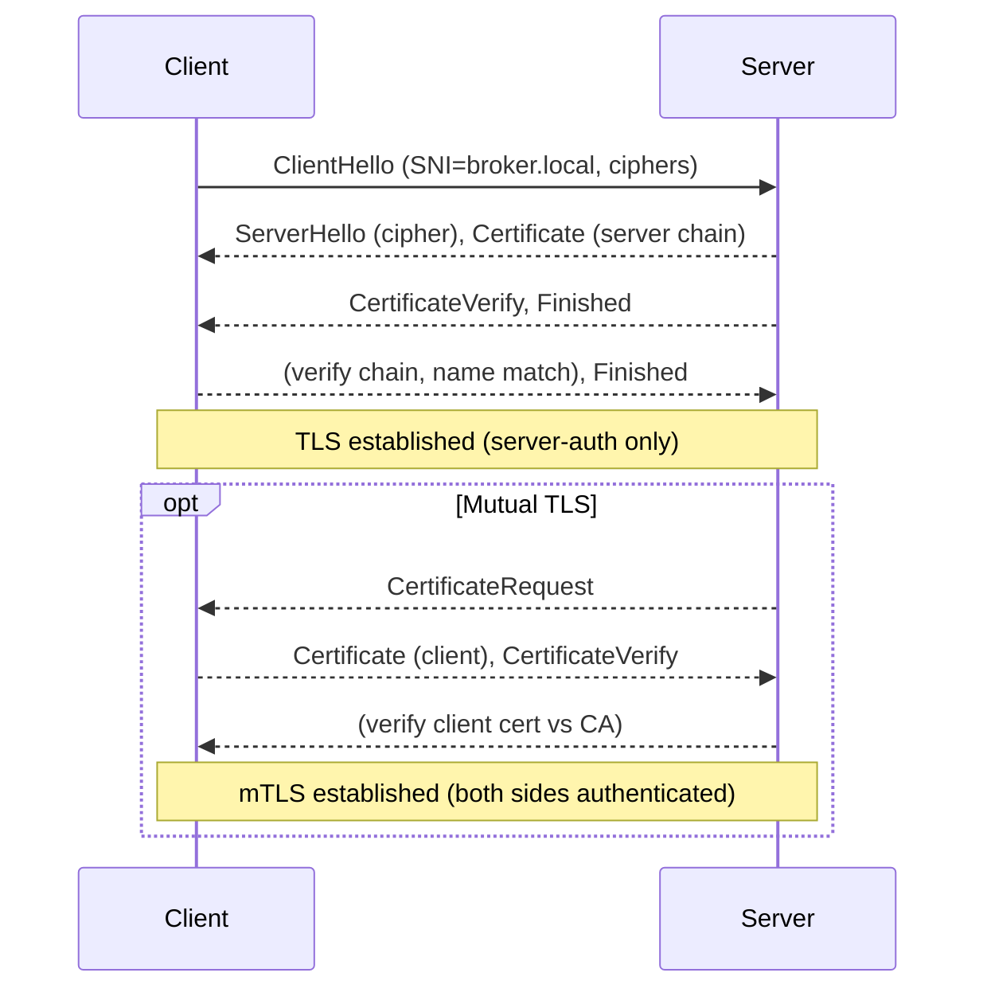

# TLS + MQTT certificates: a practical, detailed guide

This guide explains, end-to-end:
- How public key infrastructure (PKI) and X.509 certificates work
- What fields and extensions a certificate can include (and why)
- How to generate a proper CA and server/client certificates on Windows
- How to embed a unique 10‑digit identifier so you’re not tied to Wi‑Fi IPs
- How TLS handshakes work for MQTT and how to configure mutual TLS (mTLS)
- Broker and client configuration (Mosquitto + Paho) and troubleshooting

The examples align with this repo’s helpers under `tools/openssl/`.

## PKI, identities, and trust

At a high level, TLS authentication uses asymmetric crypto:
- A private key stays secret; a public key is shared.
- A Certificate Authority (CA) “signs” a certificate that binds an identity to a public key.
- Clients trust a root CA (a self-signed cert), and therefore trust leaf certs the CA signs.

Identity is conveyed by the certificate’s subject and extensions. For servers, hostname/IP identity is conveyed via SANs (Subject Alternative Name).

```mermaid
flowchart LR
  subgraph Trust Store (Client)
    CA[Root CA cert]
  end
  CA -->|verifies signature| S[Server Certificate]
  C[Client] -- TLS handshake --> S
  S -->|presents chain| C
```

## X.509 certificate anatomy (what can be included)

Key parts you’ll care about:
- Subject: Distinguished Name (DN) fields like CN, O, OU, L, ST, C. Example: `CN=gcs, OU=UAVPIDevelopers Client, O=UAVPI, C=IN`.
- Subject Alternative Name (SAN): Identities for hostname/IP/email/URI/otherName. Browsers and TLS stacks match here, not CN.
- Key Usage (KU): Allowed key operations, e.g., `digitalSignature`, `keyEncipherment`, `keyCertSign`, `cRLSign`.
- Extended Key Usage (EKU): Intended use, e.g., `serverAuth` (servers), `clientAuth` (clients).
- Basic Constraints: `CA:true` for CA certs; `CA:false` for leaves.
- Serial number: Uniquely identifies the cert.
- Custom identifiers: You can embed an application-specific ID via:
  - Subject DN `serialNumber` attribute (standard and easy to read), or
  - SAN `otherName` with a custom OID, or
  - SAN `URI` or `DNS` string with your ID embedded.

Recommended minimums:
- CA: `basicConstraints=critical,CA:true`, `keyUsage=critical,keyCertSign,cRLSign`.
- Server: `basicConstraints=CA:false`, `keyUsage=digitalSignature,keyEncipherment`, `EKU=serverAuth`, SAN includes broker name/IP.
- Client: `basicConstraints=CA:false`, `keyUsage=digitalSignature,keyEncipherment`, `EKU=clientAuth`, SAN includes stable names.

Key types: EC (prime256v1/P‑256) is efficient and widely supported; RSA‑2048 is also fine. Ed25519 works with modern OpenSSL/TLS 1.3, but some stacks/tools still lag.

## The “10‑digit key” (stable ID) without IP dependence

If your broker’s IP changes (Wi‑Fi networks), don’t bind identity to a changing IP. Use one of these patterns:
- Stable DNS name (broker.local) in SAN; point it to the current IP (hosts/DNS/mDNS). Best practice.
- Embed a stable 10‑digit ID in the certificate (for policy/authorization), independent of network address:
  - Subject DN `serialNumber=1234567890`, or
  - SAN `otherName` with a custom OID, e.g., `1.3.6.1.4.1.55555.1 = '1234567890'`, or
  - SAN `URI:urn:uavpi:drone:1234567890`.

Your TLS validation will still verify the server by name (use DNS), but your app/broker can also check the embedded ID to enforce policy. Mosquitto can map `use_identity_as_username true` from client cert CN; for custom IDs, use plugins or an auth script.

## TLS handshake (with and without mTLS)



Common causes of failure:
- “self‑signed certificate in certificate chain”: Client has a different CA than the one that signed the server certificate.
- “unknown ca” on the server logs: Broker doesn’t trust the CA that signed the client certificate.
- “hostname mismatch”: Server cert SANs don’t include the name you used to connect.

## MQTT over TLS (Mosquitto + Paho) configuration

Broker (Mosquitto) essentials:
- Point `certfile`/`keyfile` to the broker’s certificate and private key.
- Point `cafile` to the CA that signed client certs (to validate clients).
- Use `require_certificate true` to enforce client auth (mTLS).
- Prefer a stable DNS name in server cert SANs.

Example (Windows paths):

```conf
listener 8883
protocol mqtt

# Server certificate and key (from tools/openssl)
certfile "C:\\Users\\burak\\Desktop\\gcs-tuned\\tools\\openssl\\out\\server\\server-cert.pem"
keyfile  "C:\\Users\\burak\\Desktop\\gcs-tuned\\tools\\openssl\\out\\server\\server-key.pem"

# CA used to validate client certs
cafile   "C:\\Users\\burak\\Desktop\\gcs-tuned\\gcs\\certs\\ca-cert.pem"

# Enforce client certificates
require_certificate true
use_identity_as_username true
```

Client (Paho) essentials:
- Create an SSL context with `cafile` (for server chain) and set your client cert/key.
- For IP brokers or self‑hosted names, either include that exact name in SANs or use a stable DNS alias.

Pseudo‑code (see `tools/mqtt_tls_test.py`):

```python
ctx = ssl.create_default_context(ssl.Purpose.SERVER_AUTH, cafile=CA)
ctx.check_hostname = False   # if connecting via IP; prefer DNS + True
ctx.verify_mode = ssl.CERT_REQUIRED
ctx.load_cert_chain(certfile=CERT, keyfile=KEY)
client.tls_set_context(ctx)
client.connect(host, 8883, 60)
```

## Generating a proper CA and leaf certificates (OpenSSL)

You can use this repo’s ready PowerShell script, or run OpenSSL directly.

This repo’s helper (Windows PowerShell):
- `tools/openssl/gen-certs.ps1` will generate:
  - CA: `ca-cert.pem`, `ca-key.pem` (with `CA:true`, `keyCertSign,cRLSign`)
  - Server: `server-cert.pem`/`server-key.pem` (with `serverAuth`, SANs)
  - Clients: `gcs-cert.pem`/`gcs-key.pem` and `<DRONE_ID>-cert.pem`/`-key.pem` (with `clientAuth`)
- It copies leaf certs to `gcs/certs` and `drone/certs` and leaves server files under `tools/openssl/out/server/`.

Direct OpenSSL (conceptual steps):
1) Create CA key and self‑signed CA cert
```powershell
openssl genrsa -out ca-key.pem 4096
openssl req -x509 -new -key ca-key.pem -sha256 -days 3650 -out ca-cert.pem \
  -subj "/CN=Example CA" -config openssl-ca.cnf -extensions v3_ca
```
2) Create server key + CSR, then sign with CA (include SANs)
```powershell
openssl ecparam -genkey -name prime256v1 -noout -out server-key.pem
openssl req -new -key server-key.pem -subj "/CN=broker.local" -out server.csr
openssl x509 -req -in server.csr -CA ca-cert.pem -CAkey ca-key.pem -CAcreateserial \
  -out server-cert.pem -days 825 -sha256 -extfile server.cnf -extensions v3_server
```
3) Create client key + CSR, then sign with CA (clientAuth)
```powershell
openssl ecparam -genkey -name prime256v1 -noout -out device-key.pem
openssl req -new -key device-key.pem -subj "/CN=gcs/serialNumber=1234567890" -out device.csr
openssl x509 -req -in device.csr -CA ca-cert.pem -CAkey ca-key.pem -CAcreateserial \
  -out device-cert.pem -days 825 -sha256 -extfile client.cnf -extensions v3_client
```

OpenSSL config extension snippets:
```ini
[v3_ca]
basicConstraints = critical, CA:true
keyUsage = critical, keyCertSign, cRLSign
subjectKeyIdentifier = hash
authorityKeyIdentifier = keyid:always,issuer

[v3_server]
basicConstraints = CA:false
keyUsage = critical, digitalSignature, keyEncipherment
extendedKeyUsage = serverAuth
subjectAltName = @alt_names

[v3_client]
basicConstraints = CA:false
keyUsage = critical, digitalSignature, keyEncipherment
extendedKeyUsage = clientAuth
subjectAltName = @alt_names

[alt_names]
DNS.1 = broker.local
IP.1  = 127.0.0.1
```

Embedding a 10‑digit ID (examples):
- Put it in the subject DN: `-subj "/CN=drone1/serialNumber=1234567890"`.
- Or add to SAN: `otherName.1 = 1.3.6.1.4.1.55555.1;UTF8:1234567890` and reference that in `subjectAltName`.

## MQTT naming, SANs, and avoiding IP dependence

- Always include in SAN the name you use to connect. Prefer a stable DNS label (broker.local) over raw IPs.
- If IP changes, repoint the DNS label (hosts file or local DNS); no cert rotation needed.
- For clients, the broker doesn’t care about hostname verification—only about the client’s signature chain—so clients can have stable names (e.g., CN=gcs, CN=drone1) and optional IDs.

## Troubleshooting checklist

- Client error: `CERTIFICATE_VERIFY_FAILED`
  - The client CA doesn’t match the issuer of the server cert.
  - Fix: Ensure client `cafile` points to the CA that signed the broker’s server cert.
- Server log: `unknown ca`
  - Broker doesn’t trust the CA that signed the client cert.
  - Fix: Set broker `cafile` to the correct CA and restart.
- Hostname mismatch
  - Server SANs don’t include the name/IP used to connect.
  - Fix: Add the name/IP to SANs or use a stable DNS label.
- Key usage/EKU mistakes
  - CA must have `keyCertSign`; server must have `serverAuth`; clients `clientAuth`.
- Windows OpenSSL `openssl.cnf` path issues
  - Always supply `-config` for `req`/`x509` commands, or use our script which sets `OPENSSL_CONF`.

Useful probes:
```powershell
# See what the broker is serving (subject/issuer)
cmd /c "echo Q | openssl s_client -connect 127.0.0.1:8883 -showcerts -servername 127.0.0.1"

# Inspect any cert
openssl x509 -in server-cert.pem -noout -text
```

## Security hygiene and rotation

- Protect private keys (restrict filesystem ACLs). Never commit keys.
- Use reasonably short lifetimes (e.g., 1–2 years) for leaf certs; rotate CA less often.
- Revoke compromised certs (CRL/OCSP). Mosquitto supports CRLs via `crlfile`.
- Automate renewal (scripted OpenSSL or ACME if you have a domain).

## Putting it all together (this repo)

- Generate: `tools/openssl/gen-certs.ps1` (fills `gcs/certs` and `drone/certs`, server files in `tools/openssl/out/server/`).
- Configure broker: point to server cert/key and the CA as shown above; restart.
- Test: `tools/mqtt_tls_test.py` supports pub/sub with TLS and client certs.
- Prefer DNS (e.g., `broker.local`) and include it in server SANs; embed your 10‑digit ID in `serialNumber` or a SAN `otherName`.

If you want, we can tailor the OpenSSL template to embed your specific 10‑digit ID automatically in client/server certs.