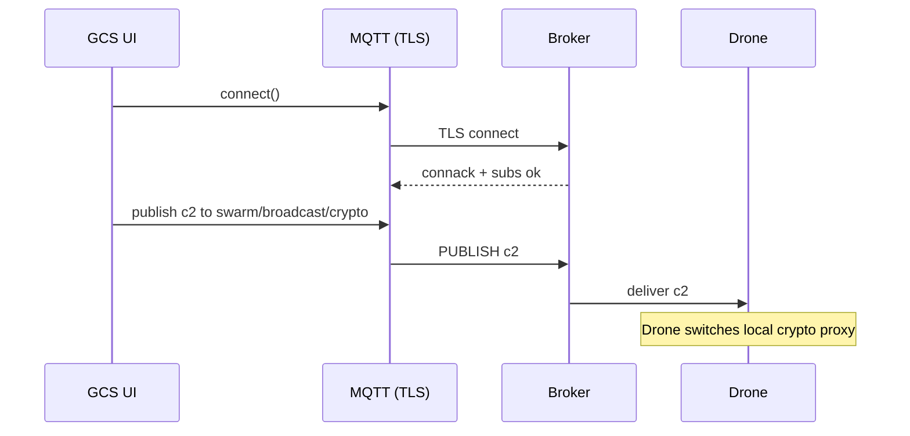
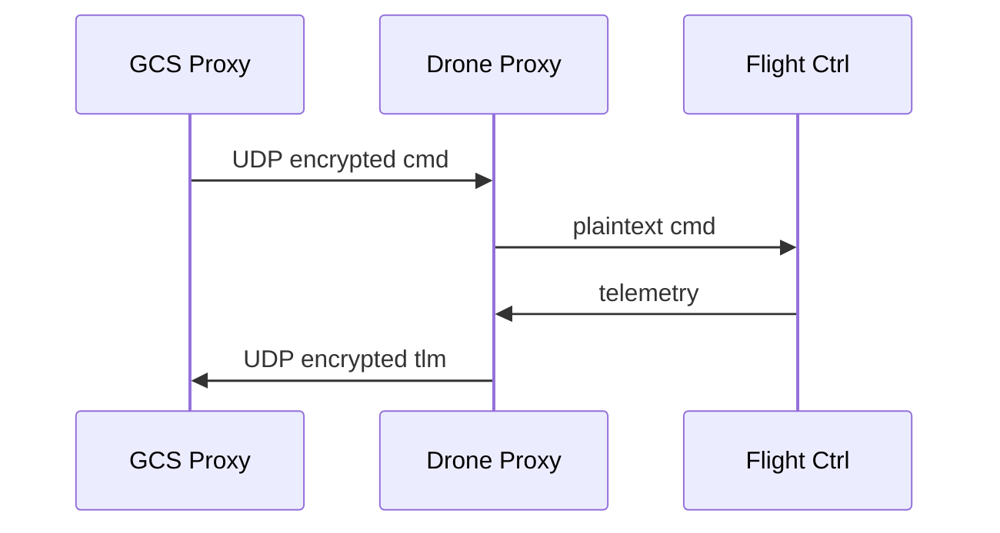

# GCS Scheduler — Visual Guide and Storyline

This guide explains the Ground Control Station (GCS) side of the system: what it does, how it schedules work, and how it stays reliable and secure. It’s meant for engineers and stakeholders—skim the visuals first, then dive into the details.

## Narrative: What the GCS does and why

In a live mission, the GCS is the control-plane brain. It orchestrates crypto proxies, the MAVLink core, and fleet coordination via MQTT+TLS. Operators can switch algorithms on-the-fly (e.g., upgrade to stronger crypto during higher threat), broadcast alerts, and track telemetry—all without interrupting flight.

## Architecture at a glance

```mermaid
flowchart LR
  subgraph GCS Host
    UI[GCS Scheduler GUI]
    M[MQTT Client (TLS)]
    P[Crypto Proxy (gcs_*.py)]
    C[MAVLink Core]
  end
  subgraph Broker
    B[(MQTT Broker)]
  end
  subgraph Drone Host
    DP[Drone Proxy]
    FC[Flight Controller]
  end

  UI -- start/stop --> P
  UI -- start/stop --> C
  UI -- publish crypto/alerts --> M
  M <--> B
  B <--> DP
  P <--> DP
  DP <--> FC
```

## Scheduling model (how the GCS “schedules” work)

- Event-driven orchestration: user actions and MQTT messages drive state changes.
- Process lifecycle control: start/stop proxies and core with safe termination and restart.
- Policy toggles:
  - Auto start core on connect
  - Auto apply local crypto when receiving broadcast code
- Connection resilience: TLS MQTT with topic subscriptions and retained status.

### Timeline (typical session)

```mermaid
gantt
  dateFormat  X
  title GCS Orchestration Timeline
  section Connect
  MQTT connect             :done, 0, 1
  Subscribe topics         :done, 1, 1
  section Start
  Start MAVLink Core       :active, 2, 1
  Start Crypto Proxy       :active, 2, 1
  section Operate
  Heartbeats/Telemetry     : 3, 5
  Crypto Switch (broadcast): 4, 1
```



## Component overview

- GcsMqttClient
  - TLS with CA validation; optional hostname verify disabled for IP brokers
  - Connects async with timeout; publishes retained “online” status
- GcsCryptoManager
  - Maps c1..c8 to local `gcs_*.py` proxies; safe process start/stop
- GcsCoreManager
  - Starts MAVLink core script (customizable) with detached stdin
- GcsMavlinkManager
  - Uses pymavlink if available; else raw UDP mode

## Message flows

### MQTT connect and broadcast crypto



### MAVLink routing through proxies



## Crypto codes and mappings

| Code | Algorithm       | Script            |
|------|-----------------|-------------------|
| c1   | ASCON‑128       | gcs_ascon.py      |
| c2   | Kyber Hybrid    | gcs_kyber_hybrid.py |
| c3   | Dilithium       | gcs_dilithium.py  |
| c4   | Falcon‑512      | gcs_falcon.py     |
| c5   | Camellia‑CBC    | gcs_camellia.py   |
| c6   | Speck‑CBC       | gcs_speck.py      |
| c7   | HIGHT‑CBC       | gcs_hight.py      |
| c8   | AES‑256‑GCM     | gcs_aes.py        |

## MQTT topics (used by GCS)

| Purpose            | Topic                            | QoS |
|--------------------|----------------------------------|-----|
| Broadcast crypto   | swarm/broadcast/crypto           | 2   |
| Broadcast alerts   | swarm/broadcast/alert            | 2   |
| GCS status         | swarm/status/gcs                 | 1   |
| Fleet status       | swarm/status/+                   | 1   |
| Drone telemetry    | swarm/drones/+/telemetry         | 1   |
| Heartbeats         | swarm/heartbeat/+                | 1   |

## Certificates and security

- Files: `ca-cert.pem`, `<client-id>-cert.pem`, `<client-id>-key.pem`
- Searched paths: `gcs/certs`, `../certs`, `C:/mqtt/certs`, `/etc/mqtt/certs`, `/home/dev/mqtt/certs`
- Optional pinning stub is available in code for strict deployments.

## IP configuration (runtime vs persistent)

- Runtime: update in-memory via `ip_config.set_hosts_runtime()` (GUI button)
- Persistent: edits `gcs/ip_config.py` in-place with timestamped comments

## Try it

1) Install deps: `pip install -r gcs/requirements.txt`
2) Ensure certs exist; set broker IP; run `gcs_mqtt_scheduler.py`
3) Switch crypto (c1..c8) and watch the fleet react.

---
For a Drone-side counterpart and deeper reliability features, see `../drone/README.md`.
